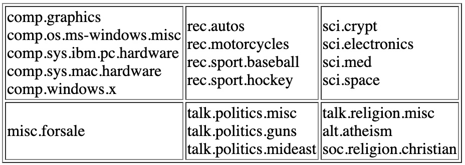
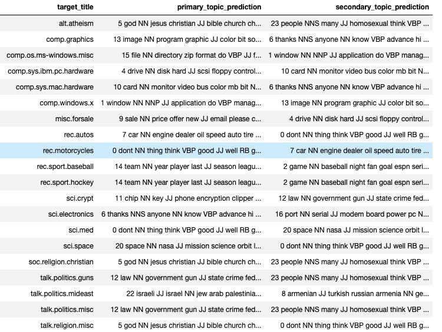

# NewsgroupAnalysis

**Author**: Dan Lee

## Business Problem

News media outlets are always on the hunt for the world's emerging stories and developments. The New York Times data team has been tasked with solving the following problem:

Can a learning algorithm be used to accurately extract topics from news text documents?

In this project, we will attempt to create a topic model to uncover the hidden word structure in a collection of newsgroup texts. The applications of this learning model would allow NYTimes another resource - beyond human intuition - at their disposal when dispatching their staff of journalists to investigate what is happening in the world. Another application of such a model would be to create a reader recommendation system for NYTimes' catalog.

We will focus on just the first step of topic modeling. Here is our proposed hypothesis:

'A model can be derived to input news related language material, so it can reliably organize the material into coherent topics.'

## Data Understanding

Our hypothesis will be tested on this 20 Newsgroups data set [20 Newsgroups data set](http://qwone.com/~jason/20Newsgroups/). It contains text data organized into 20 different newsgroups, each corresponding to a different topic. Here is a list of the 20 newsgroups partioned according to subject matter:



The data set contains 18,846 news document. Additionally each document includes a 'title,' or subject matter as seen in the table above. Topic modeling is considered unsupervised learning, meaning it can be compared to clustering. As we build clusters of words, we can check to see if these clusters resemble the subjects already given to these documents.

## Data Preparation

Key text preprocessing steps include:
1. Converting all words to lower case
2. Removing special characters and punctuation
3. Removing stop words such as 'the,' and 'a,'
4. Lemmatizing words
5. Part of speech tagging

## Modeling
We will vectorize our corpus using tf-idf, which weights words according to their total frequency but penalizes words that appear across a greater number of documents.

For modeling we will be using NMF. Though LDA performs well, it uses Gibbs sampling (random selection of documents). Within a particular corpus of words, NMF will give us repeatable results.

## Results

### Topic Modeling Results
Utilizing an NMF coherence model, we identified that our model would work best with 24 topics. The topics most assigned to each target are listed in the 'primary_topic_prediction' column.



Based on target titles, all but two target titles were assigned a coherent topic on the first try: **sci.med and rec.motorcycles**. Fortunately, secondary topics assigned to these two target titles are coherent!

## Evaluation
Our originally stated hypothesis was:

'A model can be derived to input news related language material, so it can reliably organize the material into coherent topics.'

After text preprocessing and model selection, the resulting findings are:

1. We can reliably identify coherent topics at a rate of 90%. This is significantly better than our model-less baseline of 5%.
2. We have identified an abundance of key words (e.g. law, team, price, god, space, card) that are the most significant in contributing to identification of topics.
3. Add more stop words to reduce topic 0

## Repository Structure

```
├── README.md     
<- The top-level README for reviewers of this project
├── NewsgroupAnalysis.ipynb   
<- Narrative documentation of analysis in Jupyter notebook
├── NewsgroupAnalysis.pdf
<- PDF version of Jupyter notebook
├── NonTechPresentation.pdf        
<- PDF version of project presentation
└── images                              
<- Both sourced externally and generated from code
```
≈